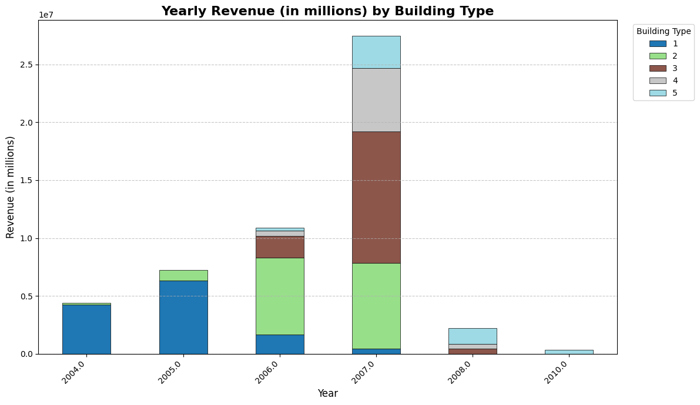
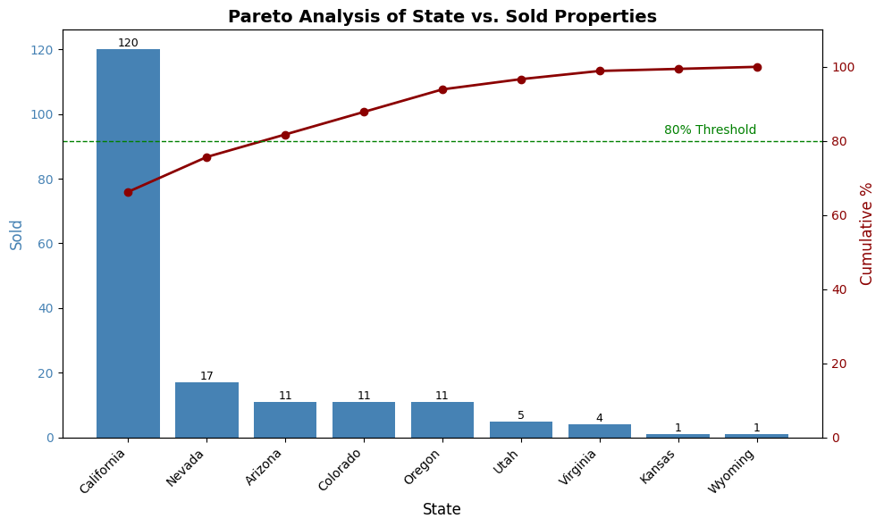

# 🏢 Real Estate Market Analysis

A comprehensive data analysis and visualization project focused on the **real estate market**, leveraging **Python (pandas, numpy, matplotlib)** to clean, preprocess, and analyze datasets of customers and property sales.

---

## 📂 Project Overview

This project aims to:
- Preprocess and clean raw real estate and customer datasets.
- Merge property and customer data for deeper insights.
- Perform descriptive statistics and exploratory data analysis (EDA).
- Visualize customer demographics, property sales, and revenue trends.
- Generate actionable insights about sales performance and customer behavior.

---

## 🛠️ Tools & Libraries

- **pandas** → data manipulation and cleaning  
- **numpy** → numerical computations  
- **datetime** → working with dates  
- **matplotlib** → data visualization

---

## 📊 Data Sources

- `customers.csv` → customer demographic and purchase intention data.  
- `properties.csv` → property details and transaction history.  

---

## 🔄 Data Preprocessing

- Fixed column naming issues from CSV import.  
- Handled null values (especially for unsold properties).  
- Converted dates (`date_sale`, `birth_date`) to datetime format.  
- Cleaned and standardized categorical values (e.g., country names).  
- Converted **price** to numeric for calculations.  
- Created new derived features:
  - `full_name` (combined name + surname).  
  - `age` (calculated from `birth_date`).  
  - Grouped bins for **age** and **price intervals**.  

---

## 📈 Key Analyses & Insights

1. **Descriptive Statistics**  
   - Distribution of sales by building type, property type, and purpose.  
   - Average area, price, and deal satisfaction across buildings and countries.  

2. **Customer Analysis**  
   - Gender distribution by property sales.  
   - Entity type (individual vs company) purchases.  
   - Age group vs. property ownership trends.  

3. **Sales Performance**  
   - Sold vs available properties across states and countries.  
   - Correlation between **price groups** and **sales success**.  
   - Mortgage adoption rate across buyers.  

---

## 📊 Visualizations

### 1️⃣ Average Satisfaction Rate by Country  
Bar chart showing the mean satisfaction score of buyers per country.

### 2️⃣ Quarterly Revenue Over Time  
Line chart of revenue trends with quarterly aggregation.

### 3️⃣ Pareto Analysis of States  
Pareto chart of sold properties per state with cumulative percentages.

### 4️⃣ Age Distribution Histogram  
Histogram of customer age distribution.

### 5️⃣ Yearly Revenue by Building  
Stacked bar chart showing revenue contribution per building type.

---

## 📷 Sample Visualizations

### Stacked Chart

### Pareto Analysis of States

---

## 📌 Future Improvements
- Add interactive visualizations with **Plotly/Seaborn**.  
- Build a **dashboard** (Streamlit/PowerBI) for real-time insights.  
- Apply machine learning for **price prediction** or **customer segmentation**.  
